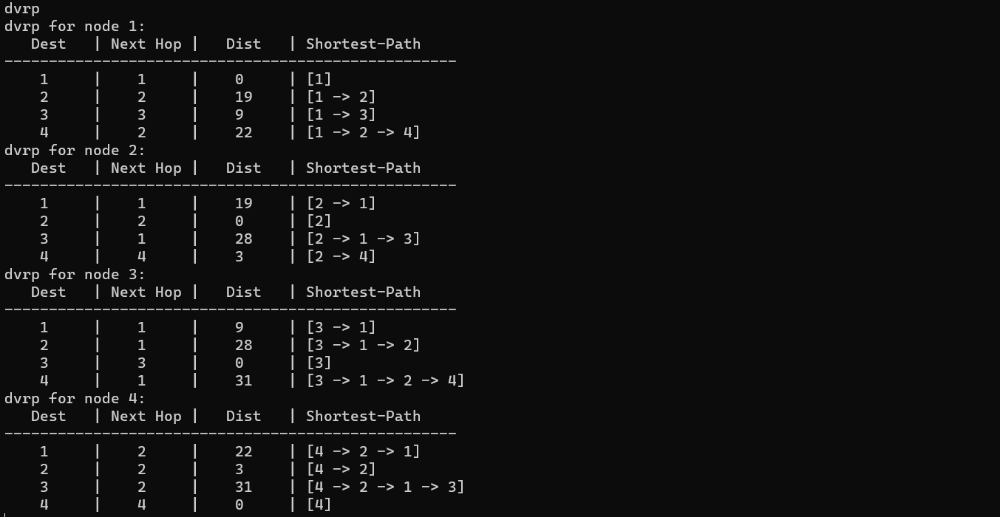

# CN_CHomeworks_3
**Maryam Jafarabadi Ashtiani : 810199549**  
**Sana Sari Navaei : 810199435**  

# Project Description
In this project, we are going to implement 3 routing algorithms in a network. The routing algorithms are:
- Border Gateway(BGP)
- Link State(LSRP)
- Distance Vector(DVRP)

We will explain each of them in the following sections.  

# Code Description  
Now we explain each part of code. We start with the main function.

## Main Function
In the `main` function, we create an object of the Command class and call the `read_command` function.  

```c++
#include "../include/main.hpp"

int main()
{
    Command command;
    command.read_command();
}
```
## Command Class
In this class, we read the command from the user and call the related function. The function `read_command()` calls the function corresponding to each command based on the type of user command.  

```c++
#include "../include/command.hpp"

void Command::read_command()
{
    std::string command;

    while(getline(std::cin, command))
    {
        std::stringstream ss(command);
        std::string args;

        //get the command and the arguments
        getline(ss,command,' ');
        getline(ss,args);

        if(command == "topology")
        {
            graph.create_graph(args);
        }
        else if(command == "show")
        {
            graph.show();
        }
        else if(command == "modify")
        {
            graph.modify(args);
        }
        else if(command == "remove")
        {
            graph.remove(args);
        }
        else if(command == "dvrp")
        {
            graph.handler_dvrp(args);
        }
    }
}
```

Now we explain every command in detail and check their functions.  

## Topology Command
The `create_graph(std::string args)` function is a member function of the Graph class. In this function, we call the `split_string(args, false)` function to seperate the edges and determine each node's neighbors and the cost of the edge between them. After a topology created, we print `OK` to the console to show that the topology is created successfully. The source and second node should not be the same. If something like this happens, we print `ERROR` to the console.  

```c++
std::vector<graphs> Graph::split_string(std::string inputString, bool just_split)
{
    std::vector<graphs> graphs_vec;
    std::stringstream ss(inputString);
    std::string word;

    while (std::getline(ss, word, SPACE))
    {
        std::stringstream row_ss(word);
        std::string row_word;
        
        int u, v, w, counter = 0;
        bool is_minus = false;
        while (std::getline(row_ss, row_word, DELIMITER))
        {
            if(row_word == "")
            {
                is_minus = true;
                continue;
            }
            if(counter == 0)
            {
                u = stoi(row_word);
                if(is_minus)
                {
                    u = -u;
                    is_minus = false;
                }
            }
            else if(counter == 1)
            {
                v = stoi(row_word);
                if(is_minus)
                {
                    v = -v;
                    is_minus = false;
                }
            }
            else if(counter == 2)
            {
                w = stoi(row_word);
                if(is_minus)
                {
                    w = -w;
                    is_minus = false;
                }
            }
            counter++;
        }

        //check if u and v are not the same
        if(!just_split)
        {
            if(!handle_same_nodes(u, v))
            {
                graphs g = {u, v, w};
                graphs rg = {v, u, w};
                graphs_vec.push_back(g);
                graphs_vec.push_back(rg);

                nodes.insert(u);
                nodes.insert(v);
            }
        }
        else
        {
            graphs g = {u, v, w};
            graphs_vec.push_back(g);
        }
    }
    return graphs_vec;
}

void Graph::create_graph(std::string args)
{
    edges = split_string(args, false);
    std::cout << "OK" << std::endl;
}
```

## Show Command
The `show()` function is a member function of the Graph class. In this function, we print the topology in a spcific format to the console.  when the first and second node are the same, we print 0 and when there is no edge between two nodes, we print -1.  

```c++
void Graph::show()
{
    if(edges.size() == 0)
    {
        std::cout << EMPTY_GRAPH << std::endl;
        return;
    }

    std::cout << "     |";
    int max_size = 5;
    for (auto node: nodes)
    {
        int findNumDigit = countDigits(node);
        int space_size = max_size - findNumDigit;
        print_handler(std::to_string(node), space_size);
    }

    std::cout << std::endl;
    int delim_count = (nodes.size() + 2) * max_size;
    for (int i = 0; i < delim_count; i++)
        std::cout << "-";

    std::cout << std::endl;
    for(auto node: nodes)
    {
        int findNumDigit = countDigits(node);
        int space_size = max_size - findNumDigit;

        print_handler(std::to_string(node), space_size);
        std::cout << "|";

        for(auto node2: nodes)
        {
            if(node == node2)
            {
                //print 0
                int findNumDigit = countDigits(0);
                int space_size = max_size - findNumDigit;
                print_handler(std::to_string(0), space_size);
                continue;
            }
            
            bool found = false;
            for (int i = 0; i < edges.size(); i++)
            {
                
                if(edges[i].u == node && edges[i].v == node2)
                {
                    int findNumDigit = countDigits(edges[i].w);
                    int space_size = max_size - findNumDigit;
                    found = true;
                    print_handler(std::to_string(edges[i].w), space_size);
                    break;
                }
            }
            if(!found) //print -1
                std::cout << " " << -1 << "  ";
        }
        std::cout << std::endl;
    }
}
```
## Modify Command
In `modify(std::string args)` function, we call the `split_string(args, true)` function to seperate the edges and determine each node's neighbors and the cost of the edge between them. After that, we check if the edge is already in the topology. If it is, we change the cost of the edge. If it is not, we add the edge to the topology. We print `OK` to the console to show that the topology is modified successfully. Otherwise, we print `ERROR` to the console.  

```c++
void Graph::modify(std::string args)
{
    std::vector<graphs> this_edge = split_string(args, true);
    int s = this_edge[0].u;
    int d = this_edge[0].v;
    int c = this_edge[0].w;
    if (s == d)
    {
        std::cout << ERROR << std::endl;
    }
    else if(nodes.count(s) && nodes.count(d))
    {
        int index;
        if(index = check_if_exist(s, d))
        {
            edges[index - 1].w = c;
            edges[index].w = c;
        }
        else
        {
            graphs new_graph = {s, d, c};
            graphs new_graph2 = {d, s, c};
            edges.push_back(new_graph);
            edges.push_back(new_graph2);
        }
        std::cout << "OK" << std::endl;
    }
    else
    {
        std::cout << ERROR << std::endl;
    }
}
```

## Remove Command
In `remove()` function, we remove the edge between two nodes. At first, we determine the first and second node. Then we check if both nodes s and d exist in the graph. If they do, then we check if there is an edge between them, if there is, we remove the edge. Otherwise, we print `ERROR` to the console.  

```c++
void Graph::remove(std::string args)
{

    std::vector<std::string> result = check_format(args);
    if(result[0] != "")
    {
        int s = stoi(result[0]);
        int d = stoi(result[1]);
        int index;
        if (nodes.count(s) && nodes.count(d))
        {
            if(index = check_if_exist(s, d))
            {
                edges.erase(edges.begin() + index);
                edges.erase(edges.begin() + index - 1);
                std::cout << "OK" << std::endl;
            }
            else
            {
                std::cout << ERROR << std::endl;
            }
        }
        else
        {
            std::cout << ERROR << std::endl;
        }
    }
    else
        std::cout << ERROR << std::endl; 
}
```
# Algorithms
## Link State (LSRP)
The Link State Routing Protocol (LSRP) algorithm is a routing algorithm used in computer networks to determine the shortest path between nodes in a network graph. It is a dynamic routing algorithm that builds a complete view of the network by exchanging information about link costs and topology changes among the network nodes.
Here are the steps of the implementation: 

-Initialization: Each node in the network graph initializes its own state, including its own identifier, link costs to neighboring nodes, and a database of known network information.

-Flooding of Link State Advertisements (LSAs): Each node floods its LSAs throughout the network. LSAs contain information about the node's identifier, link costs, and other relevant network information. (here in our code it is known as "edges" vector which is included the nodes and the link between them.)

-Building the Shortest Path Tree: Each node collects LSAs from all other nodes and constructs a complete view of the network topology. This information is used to build a shortest path tree rooted at the node itself, which represents the shortest paths to all other nodes in the network.

-Dijkstra's Algorithm: Using the shortest path tree, each node applies Dijkstra's algorithm to compute the shortest path from itself to all other nodes. This algorithm determines the minimum cost paths by iteratively selecting the next node with the minimum distance and updating the distances to its neighbors.

Now we explain the lsrp command in our code:  
when we enter `lsrp <source node>`, it means that the function `lsrp(int source)` is called only once and shows the route from the requested node. But when we enter `lsrp`, the function `lsrp()` is called multiple times and it shows the route from all nodes. The funtion `handler_lsrp(std::string args)` does this. If we have source node, calls the function one time. And if we don't have specific source node, calls the function as many as the number of nodes.   
The function `lsrp(int source)` as I mentioned above use dijkstra's algorithm to find the shortest path. and the three new vectors (distance, parent, visited) which are declared here are used in order to implement dijkstra. 
```c++
int Graph::minDistance(std::vector<int> distance, std::vector<bool> visited)
{
    int min = INFINITY, min_index;
    for (int v = 0; v < nodes.size() + 1; v++)
        if (visited[v] == false && distance[v] <= min)
            min = distance[v], min_index = v;
    return min_index;
}

void Graph::lsrp(int source)
{
    int nodes_size = nodes.size() + 1;
    std::vector<int> distance(nodes_size);
    std::vector<int> parent(nodes_size);
    std::vector<bool> visited(nodes_size);

    for (int i = 0; i < nodes_size; i++)
    {
        distance[i] = INFINITY;
        parent[i] = -1;
        visited[i] = false;
    }

    distance[source] = 0;

    for (int i = 0; i < nodes.size() - 1; i++)
    {
        int u1 = minDistance(distance, visited);
        visited[u1] = true;

        for (int j = 0; j < edges.size(); j++)
        {
            int u = edges[j].u;
            int v = edges[j].v;
            int w = edges[j].w;
            if(u1 == u && visited[v] == false && distance[u] != INFINITY)
            {
                if(distance[u] + w < distance[v])
                {
                    distance[v] = distance[u] + w;
                    parent[v] = u;
                }
            }
        }
        std::cout << "Iter " << i + 1 << ":\n";
        print_lsrp(distance);
    }
    print_lsrp2(source, distance, parent);
}
```

## Distance Vector (DVRP)  
Distance Vector Routing Protocol (DVRP) is a type of routing protocol used in computer networks to determine the best path for data packets to travel from a source to a destination. In DVRP, each router maintains a table that lists the distance to each destination network and the next hop router to reach that network. The router periodically broadcasts its routing table to its neighboring routers, which use this information to update their own routing tables. This process continues until all routers in the network have converged on a consistent set of routing tables.  

There are some advantages and disadvantages of DVRP:
- Advantages:
    - Simplicity
    - Compatibility
    - Low overhead
- Disadvantages:
    - Slow convergence
    - Routing loops
    - Limited metrics

Now we explain the dvrp command in our code:  
when we enter `dvrp <source node>`, it means that the function `dvrp(int source)` is called only once and shows the route from the requested node. But when we enter `dvrp`, the function `dvrp()` is called multiple times and it shows the route from all nodes. The funtion `handler_dvrp(std::string args)` does this. If we have source node, calls the function one time. And if we don't have specific source node, calls the function as many as the number of nodes.   
The function `dvrp(int source)` implements the distance vector algorithm to compute the DVRP for a given node. It uses two vectors to store the distance and parent information for each node, and iteratively updates these vectors until the shortest path to each node is found.  

```c++
void Graph::dvrp(int source)
{
    int nodes_size = nodes.size() + 1;
    std::vector<int> distance(nodes_size);
    std::vector<int> parent(nodes_size);

    for (int i = 0; i < nodes_size; i++)
    {
        distance[i] = INFINITY;
        parent[i] = -1;
    }

    distance[source] = 0;
    for (int i = 1; i < nodes_size; i++)
    {
        for (int j = 0; j < edges.size(); j++)
        {
            int u = edges[j].u;
            int v = edges[j].v;
            int w = edges[j].w;
            if (distance[u] + w < distance[v])
            {
                distance[v] = distance[u] + w;
                parent[v] = u;
            }
        }
    }

    print_dvrp(source, distance, parent);
}
```
# Ouputs
In this section, the output of the commands for each section is given separately.  
## topology

## show

## modify

## remove

## lsrp

- lsrp 1  

- lsrp  

## dvrp

- dvrp 1  

- dvrp  

